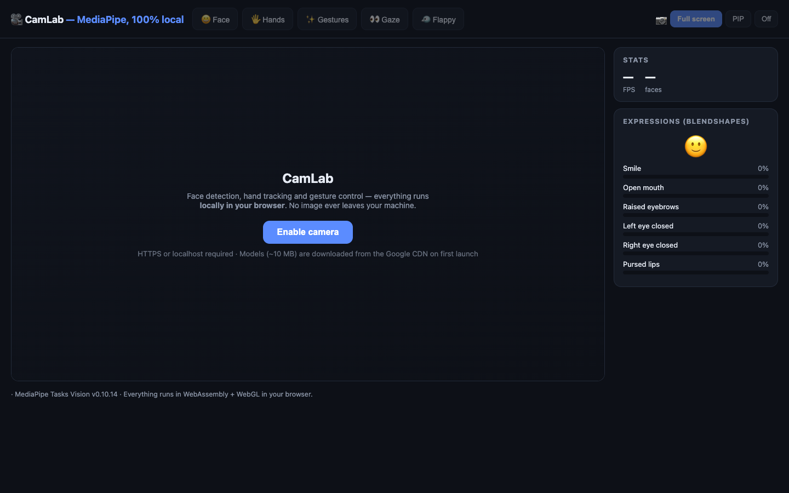

# CamLab 🎥

[](https://github.com/yassinehamouten/camlab/actions/workflows/ci.yml)
[](https://yassinehamouten.github.io/camlab/)

**[▶️ Live demo](https://yassinehamouten.github.io/camlab/)**



A webcam lab in the browser: face tracking, hand tracking, gesture control, gaze
pointing, and a Flappy Bird clone driven by an open palm. Powered by
**MediaPipe Tasks Vision** — everything runs **locally** in WebAssembly,
no image ever leaves your machine.

## The 5 modes

| Mode | What it shows |
|------|---------------|
| 😀 **Face** | 468-point face mesh + real-time expressions (smile, blinks…) via blendshapes |
| 🖐 **Hands** | 21-point skeleton × 2 hands + raised-finger counter |
| ✨ **Gestures** | Cursor driven by your index finger + dwell-click to color tiles |
| 👀 **Gaze** | Head + iris pointing, 9-point calibration via linear regression, 3×3 grid |
| 🐦 **Flappy** | Flappy Bird clone: every 🖐 open palm flaps the wings, best score persisted |

A 📷 **Full / PIP / Off** selector controls the camera display in every mode.

## Getting started

```bash
npm install
npm run dev        # Vite + HMR → http://localhost:5173
npm test           # 29 Vitest tests on the pure logic
npm run build      # production build into dist/
```

> ⚠️ `getUserMedia` requires a secure context: **localhost** or **HTTPS**.
> On first launch, the models (~10 MB) are downloaded from the Google CDN.

## Architecture

```
index.html          markup + styles
src/main.js         camera bootstrap, rAF loop, canvas rendering, DOM
src/lib/math.js     clamp01, dot, gaussSolve, solveLinear (least squares + ridge)
src/lib/gaze.js     gaze metrics, features, 9-point calibration (fitGazeModel)
src/lib/flappy.js   pure game physics (createGame, stepGame, collisions)
src/lib/hands.js    extended-finger counting
test/*.test.js      Vitest tests on the pure logic
```

Pure logic (math, calibration, physics) is isolated in `src/lib/` and unit-tested;
canvas rendering and MediaPipe integration live in `main.js`.

## Technical notes

- Models are **pinned**: `@mediapipe/tasks-vision@0.10.14` + `float16/1` models (Google CDN)
- `GestureRecognizer` runs on **CPU**: known GPU/WebGL macOS bug (silently empty results)
- API quirk: `GestureRecognizer.recognizeForVideo` ≠ `detectForVideo`
- ⚠️ Never name an HTML element `id="dbg"`: element ids become globals
  (`window.dbg`) and collide with a function inside the MediaPipe WASM glue
- Gaze calibration: 9 dots shown sequentially → affine regression via normal
  equations (1e-6 ridge). Quick recalibration: close your eyes for 1 s

## Ideas for going further

1. Tunable dwell-click + gaze-pointed virtual keyboard → hands-free accessibility
2. Index-thumb pinch (distance between landmarks 4↔8) → grab / zoom
3. Background removal (Selfie Segmentation) for video calls
4. Custom gesture signatures: KNN over the 21 landmarks after recording samples

## License

[MIT](./LICENSE)
